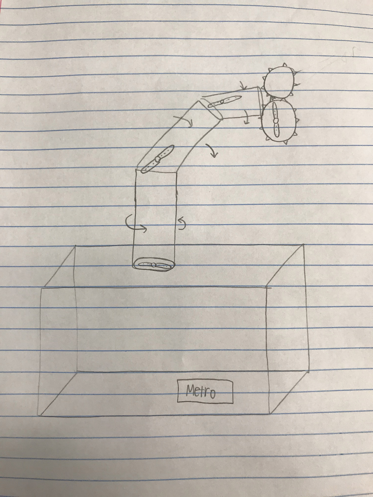

# Robot Arm 
> Zoe, Abby, Daeshon :robot:

## Planning

### Goal
- Construct a Metro-controlled robot arm from materials in the sigma lab.

### Background
- We chose to do a relatively straight forward robot arm design becuase that is what we felt most spoke to us as a group, and the best way for us to use all of our talents together. We like the idea that this is a project that will always be useful and relevant, and that we will be able to accomplish it in the given timeframe. Additionally, we like that this robot arm can be very versatile, whether it is used for picking up objects or just as a toy to display. Lastly, I personally (Abby) love this idea because I can see so many potential uses for it in various BACON outreach activities. I feel that it would be super helpful to have a working robot arm lying around the lab that I can trust, understand, and explain well when taking it to outreach events.
- Going into the history of robot arms is super interesting. The robotic or mechanical arm was something that was originally designed to serve a purpose, not as a side invention just for fun, and it hasn't strayed from that purpose ever since. Whether they are meant for manufacturing, surgery, or prosthetics. It is very interesting that the robot arm has so many different and important uses.

### Resources/Materials
- 4-6 servos
- Metro Express
- 9V battery pack
- Gears made out of 3mm acrylic
- 5 mm LEDs
- Switch (for power)
- Potentiometers (for controlling servos) 
- 3D printer and laser cutter

### Ideas
- Each servo corresponds to the moving parts of the arm (left/right, up/down, open/close)
 - Potentiometers on the base of the arm will control each direction
- Labels will be printed to indicate what servo it corresponds to
- The base of the arm is just a box, containing the metro and battery pack
- One side of the box will be able to open with a hinge/knob, in order to allow easy access if the wiring or batteries    had to be changed
- It will use continuous rotation servos
- Approximate size of box: length = 150 mm, width = 100 mm, height = 80 mm

### Overview
- *Solidworks*
  1. Base of the arm
     - Box connected by corner tabs
     - Properly dimensioned holes for screws, metro, led, switch, and potentiometers
     - Hinge for one side of the box
  2. "Claw” that picks up the object
     - Each side has gears on one end, when they are connected it makes the claws open and close together when only one         of them is being controlled by the servo
     - The other side has “teeth”
     - The ridges make it less slippery and less likely to drop the object
  3. Servo holders 
     - Material surrounding the base of the servo and connects to the acrylic
    
- *Wiring/Code*
  1. Four servos
  2. Potentiometers that control each of the servos
  3. Processing gui that controls the servos
  4. Switch that flips between dial control and gui control
  5. Power switch and power led wired with battery pack
  
### Scope
- All of the wiring and code is fairly straightforward
- Some difficulties may include
  - Figuring out how to fit all of the wiring onto one metro and maximize space
  - Making sure the potentiometer is set up to move the servo in the correct direction 
  - Constructing gears that fit together and move effectively
  - Adjusting the amount of material used so there isn't too much stress on the arm
  - Making the gui precise and user friendly

## Documentation

### Schedule
- [x] 1/31 - finished plan & sitting together.
- [x] 2/7 - rough dimensions figured out on solidworks, 4 servos with potentiometers coded on circuitpython.
- [x] 2/14 - servos and dials wired, processing gui started
- [x] 2/21 - processing gui polished up
- [x] 2/28 - switch built in to switch between potentiometer and processing control
- [ ] 3/6 - battery pack, power switch, and power led wired up
- [ ] 3/13 - wiring transferred to prototyping shield and new panel mount potentiometers soldered
- [ ] 3/20 - assembly and finishing touches
- [ ] 3/27 - assembly and finishing touches

### Update
- As of March 13, 2020, when we had our last day of in person school for the year, our project was progressing quite well. Abby had completely finished the code, including manual potentiometer control of four servos, as well as a processing GUI for control, so save any last minute changes or finishing touches, the code is fully functional and done. Additionally, that last week, Abby made a fritzing for all her wiring and Daeshon started soldering some of the panel mounted components that would be necessary in the final project. Zoe contined to work on the SolidWorks, and we have a pretty solid assembly that includes a box at the bottom, and a few tiers of arm built up. 
